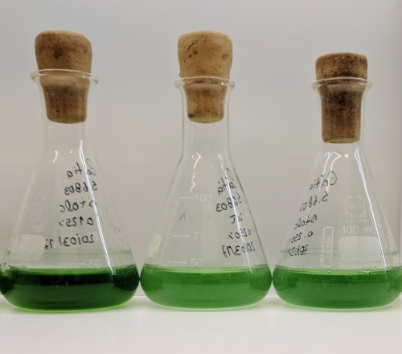

---
# An instance of the Portfolio widget.
# Documentation: https://wowchemy.com/docs/page-builder/
widget: blank

# This file represents a page section.
headless: true
active: true

# Order that this section appears on the page.
weight: 10

title: Research Projects
subtitle: ''

design:
  # Choose how many columns the section has. Valid values: '1' or '2'.
  columns: '1'

  # Toggle between the various page layout types.
  #   1 = List
  #   2 = Compact
  #   3 = Card
  #   5 = Showcase
  view: 1

---

## **PhD Research Project**

### Publications associated

Morris, H., **Gonçalves, C.F.**, Dudek, M., Hoyland, J., and Meng, Q.-J., (**2021**) Tissue physiology revolving around the clock: circadian rhythms as exemplified by the intervertebral disc. Annals of the Rheumatic Diseases, 80 (7), 828–839.

Yang, N., Smyllie, N.J., Morris, H., **Gonçalves, C.F.**, Dudek, M., Pathiranage, D.R.J., Chesham, J.E., Adamson, A., Spiller, D.G., Zindy, E., Bagnall, J., Humphreys, N., Hoyland, J., Loudon, A.S.I., Hastings, M.H., and Meng, Q.-J., (**2020**) Quantitative live imaging of Venus::BMAL1 in a mouse model reveals complex dynamics of the master circadian clock regulator. PLOS Genetics, 16 (4), e1008729.

**Gonçalves, C.F.** and Meng, Q.-J., (**2019**) Timing metabolism in cartilage and bone: links between circadian clocks and tissue homeostasis. Journal of Endocrinology, 243 (3), R29–R46.

## **MSc Research Project**

 Multiprotein transport systems have been thoroughly studied in proteobacteria. However, knowledge about these assemblies in cyanobacteria remains scarce, even regarding the identity of the molecular components. For my Master’s dissertation, I focused on the characterisation of multiprotein transport complexes in _Synechocystis_ sp. PCC 6803.

  <figure>
    
    <figcaption><b>Figure 1</b>: <i>Synechocystis</i> sp. PCC 6803 cultures.</figcaption>
  </figure>

My research helped to elucidate the complexity of TolC-dependent secretion mechanisms, and the importance of these systems to counteract the detrimental effects exerted by compounds with antimicrobial activity on cell physiology. It also highlighted the existence of TolC-independent functions among some multidrug efflux components, suggesting these transport complexes have roles relevant to the physiology of bacteria that stretch beyond antimicrobial resistance.

In addition, I performed the molecular (whole-genome sequencing) and phenotypic characterisation of two _Synechocystis_ strains (unpublished).

### Publications associated

**Gonçalves, C.F.**, Lima, S., and Oliveira, P., (**2021**) Product export in cyanobacteria. In: Cyanobacteria Biotechnology. John Wiley & Sons, 369–406.

**Gonçalves, C.F.**, Pacheco, C.C., Tamagnini, P., and Oliveira, P., (**2018**). Identification of inner membrane translocase components of TolC-mediated secretion in the cyanobacterium _Synechocystis_ sp. PCC 6803. Environmental Microbiology, 20 (7), 2354–2369.

**Gonçalves, C.F.**, Lima, S., Tamagnini, P., and Oliveira, P., (**2019**) Cyanobacterial secretion systems: understanding fundamental mechanisms toward technological applications. In: A.K. Mishra, D.N. Tiwari, and A.N. Rai, eds. Cyanobacteria. Academic Press, 359–381.
